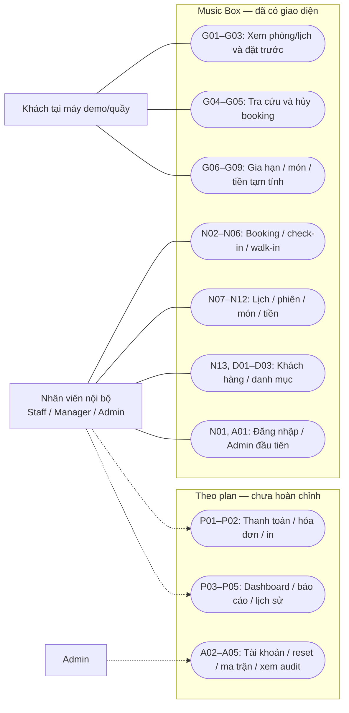
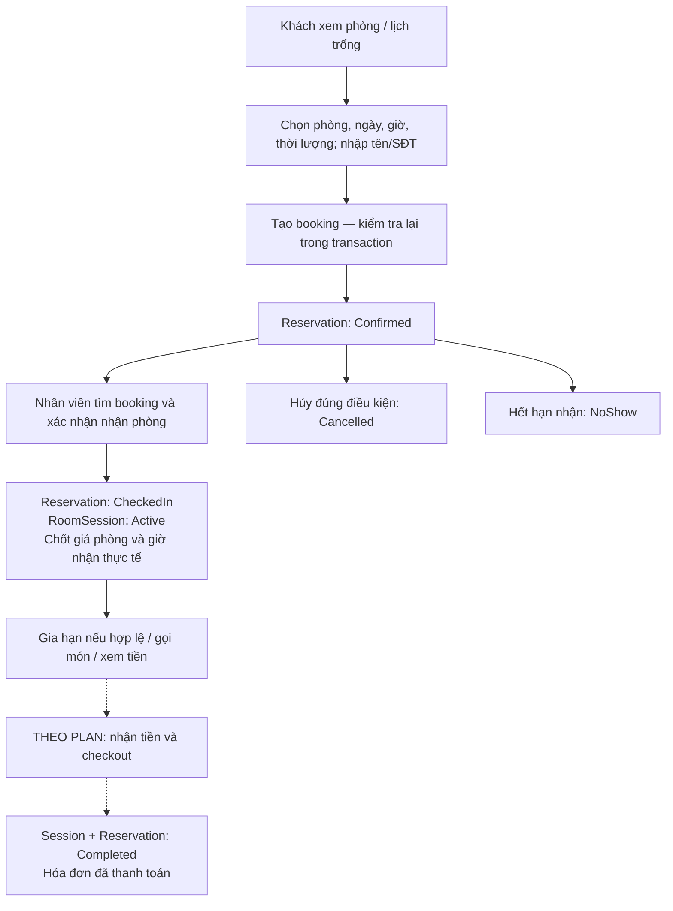
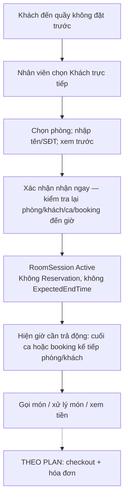
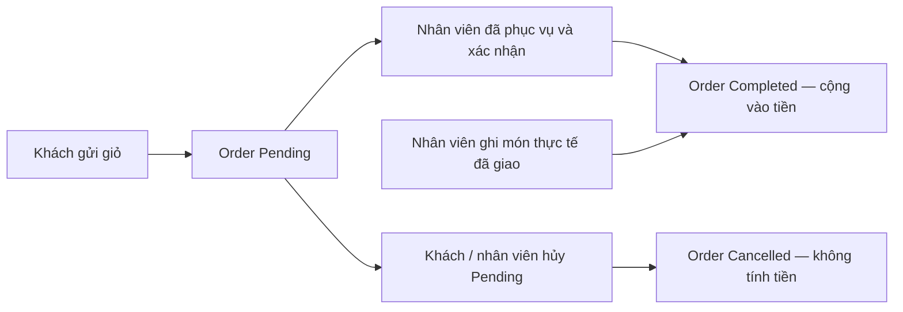

# Music Box WPF — Use case và đánh giá luồng nghiệp vụ

Ngày rà soát: **11/10/2026**. Mốc mã nguồn: **6071be0**, hoàn thành 6e.2.

Tài liệu mô tả việc người dùng thực sự làm được qua giao diện hiện tại, đồng thời giữ các chức năng chưa triển khai trong phạm vi bản cuối. Nền tảng: WPF .NET Framework 4.7.2 + SQLite v7; chế độ Khách dùng tại máy demo/quầy.

## 1. Nhận xét chính

**Luồng đặt phòng và sử dụng phòng đã khá nhất quán; luồng phục vụ chưa khép kín vì thiếu trả phòng/thanh toán/hóa đơn.** Có thể demo đặt trước, nhận phòng, nhận khách trực tiếp, gia hạn, gọi món, xử lý đơn và tiền tạm tính. Chưa thể demo trọn một lượt từ nhận khách đến thu tiền và giải phóng phòng bằng thao tác nghiệp vụ thật.

Ba điểm cần ưu tiên:

1. Hoàn thành checkout/hóa đơn để phiên Active được kết thúc hợp lệ. Hiện đến giờ trả không tự kết thúc phiên; không thể nhận lượt tiếp theo nếu phòng vẫn có Active.
2. Hoàn thành quản trị tài khoản/role/ma trận quyền. RBAC đã kiểm tra quyền hiện hành, nhưng người vận hành chưa có màn hình tạo tài khoản Staff/Manager hoặc chỉnh quyền. Tài khoản được tạo bằng fixture trong test không phải chức năng quản trị đã bàn giao.
3. Làm dashboard vận hành để nhân viên thấy booking sắp hết hạn, khách quá giờ và đơn chờ. Các màn hình riêng đã có, nhưng nhân viên vẫn phải chuyển màn hình và tải lại thủ công để ghép tình hình quán.

Đây là đánh giá từ tài liệu và mã nguồn, không phải nghiệm thu mới bằng dữ liệu thật. Kết quả gần nhất tại bước 6e.2: Debug/Release và 22 bộ kiểm tra đạt trên dữ liệu tạm, UI render 100 ảnh. Lần rà soát này chỉ tạo tài liệu, không đổi nghiệp vụ hoặc chạy lại toàn bộ test.

## 2. Nguồn đối chiếu và cách đọc tiến độ

- [AGENTS.md](../AGENTS.md): quyết định đã chốt, quy tắc làm việc và tiến độ cập nhật.
- [README.md](../README.md): hướng dẫn chạy và trạng thái triển khai.
- [Plan WPF](../MusicBoxManagement_Wpf_ProjectPlan_v0.1.md): phạm vi nền tảng, vận hành, thanh toán, quản trị/báo cáo.
- [Plan nghiệp vụ tham chiếu v1.3](Reference_Web_ProjectPlan_v1.3.md): mục 4–17, 21–33, 38–48, 54–56.
- Báo cáo bước 3–6e.2 và các service/viewmodel/window liên quan; bảng đối chiếu ở mục 11.

Một số báo cáo bước cũ nói “chưa có check-in/gia hạn/gọi món” vì đó là hiện trạng tại ngày viết. Không cộng các câu này thành thiếu sót của bản hiện tại. Tiến độ hiện tại được xác định từ cập nhật mới nhất **và mã nguồn**. Tương tự, có permission `Session.CheckOut` hoặc dữ liệu fixture Completed không có nghĩa đã có service checkout/hóa đơn.

Các nhãn trong tài liệu:

| Nhãn | Ý nghĩa |
| --- | --- |
| Đã có | Có đường service và giao diện dùng được cho mục tiêu nêu trong dòng |
| Một phần | Có nền tảng hoặc một nhánh; mục tiêu đầy đủ chưa hoàn tất |
| Theo plan | Chức năng bắt buộc ở bản cuối, chưa có luồng hoàn chỉnh hiện tại |

## 3. Actor và ranh giới hệ thống

| Actor | Mục tiêu | Cách truy cập |
| --- | --- | --- |
| Khách | Xem/đặt phòng, tra cứu lượt của số điện thoại đã nhập, gia hạn, gọi/hủy món chờ, xem tiền | Chế độ Khách, không tài khoản; thao tác trên booking/Active theo SĐT hiện hành |
| Nhân viên nội bộ | Tiếp nhận khách, theo dõi lịch/phiên, xử lý món và thanh toán | Đăng nhập; quyền thao tác đọc từ database |
| Manager | Vận hành và quản lý danh mục, xem báo cáo/doanh thu theo quyền | Một role nội bộ, không mặc nhiên kế thừa thay đổi quyền của Staff |
| Admin | Vận hành toàn bộ và quản trị tài khoản/quyền/nhật ký | Admin luôn toàn quyền cố định; UI quản trị đầy đủ còn ở bước 8 |
| Người thiết lập ban đầu | Tạo Admin đầu tiên để bắt đầu vận hành | Chỉ khi chưa có tài khoản, qua màn hình Thiết lập Admin |

**“Nhân viên nội bộ” trong sơ đồ là nhóm người đăng nhập, bao gồm Staff/Manager/Admin; không phải một role thứ tư.** Staff, Manager và Admin là ba role thực tế. Các liên kết actor–use case thể hiện khả năng tham gia theo quyền; không cấp quyền tự động bằng sơ đồ.

SQLite, service, viewmodel và bộ hẹn giờ NoShow là thành phần bên trong Music Box, không phải actor bên ngoài. NoShow là xử lý tự động do thời gian kích hoạt. Ngân hàng không phải actor tích hợp: BankTransfer ở plan chỉ là nhân viên ghi nhận đã nhận tiền thủ công.

## 4. Danh sách use case

### 4.1 Khách

| ID | Use case — mục tiêu của Khách | Hiện trạng | Điều kiện chính |
| --- | --- | --- | --- |
| G01 | Xem phòng và thông tin loại phòng | Đã có | Chỉ danh sách phòng mở; loại/sức chứa/tiện ích/giá hiện tại |
| G02 | Xem lịch trống/bận của phòng | Đã có | Theo phòng/ngày/thời lượng; không dữ liệu khách khác |
| G03 | Đặt phòng trước | Đã có | Phòng/khách không trùng lịch, ngày/slot/ca hợp lệ; tạo Confirmed ngay |
| G04 | Tra cứu booking và phiên đang dùng bằng SĐT | Đã có | Số chuẩn hóa hiện hành; Confirmed còn hiệu lực và Active |
| G05 | Hủy booking của số đã tra cứu | Đã có | Confirmed còn hiệu lực; trước hoặc đúng StartTime − 2 giờ |
| G06 | Gia hạn phiên đang dùng | Đã có | Active từ booking; +30/+60, chưa quá ExpectedEndTime, đủ ca/lịch |
| G07 | Gọi món cho phiên đang dùng | Đã có | Active đúng số; món đang bán; trong ca; gửi thành Pending |
| G08 | Xem đơn và hủy đơn chờ của phiên | Đã có | Chỉ phiên Active đúng số; hủy chỉ Pending |
| G09 | Xem/cập nhật tiền tạm tính | Đã có | Active đúng số; tiền phòng thực tế + món Completed |

Khách không tự nhận phòng, tự xác nhận đã phục vụ hoặc tự xác nhận đã thu tiền. Guest Lookup theo SĐT là quy ước demo đã chốt, không phải bước xác minh danh tính bằng OTP. Không thay quy ước này trong đợt rà soát.

### 4.2 Vận hành nội bộ

| ID | Use case | Hiện trạng | Quyền/đường UI hiện tại |
| --- | --- | --- | --- |
| N01 | Đăng nhập/đăng xuất khu vực nhân viên | Đã có | Tài khoản active; đăng xuất về chế độ Khách |
| N02 | Đặt phòng hộ khách | Đã có | `Reservation.Create`, không cần quyền xem booking hoặc Customer CRUD |
| N03 | Tìm/xem booking | Đã có | `Reservation.View`; ngày/SĐT/trạng thái |
| N04 | Hủy booking nội bộ | Đã có | UI xem + `Reservation.Cancel`; lý do bắt buộc; không hạn 2 giờ của Guest |
| N05 | Nhận phòng từ booking | Đã có | UI xem + `Session.CheckIn`; service check-in không tự đòi View |
| N06 | Nhận khách trực tiếp — walk-in | Đã có | `Session.WalkIn` độc lập; không tạo Reservation, không chọn duration |
| N07 | Xem lịch phòng ngày/tuần | Đã có | `Calendar.View`; có thông tin nội bộ; chỉ đọc |
| N08 | Tìm/xem phiên sử dụng | Đã có | `Session.View`; Active/Completed, SĐT, snapshot, giờ thực tế/dự kiến |
| N09 | Gia hạn hộ khách | Đã có | UI `Session.View` + `Session.Extend`; API lõi Extend độc lập View |
| N10 | Xem và xử lý đơn chờ | Đã có | Xem `Order.View`; phục vụ thêm `Order.Confirm`; hủy thêm `Order.Cancel` |
| N11 | Ghi món đã phục vụ cho khách | Đã có | `Order.Create` độc lập View/Confirm/Session.View; tạo Completed ngay |
| N12 | Xem/cập nhật tiền tạm tính của phiên | Đã có | `Session.View`; không đòi Order.View để đọc số tổng hợp |
| N13 | Tìm/thêm/sửa khách hàng | Đã có cho danh mục | View và Create/Edit riêng; chuẩn hóa SĐT, không xóa khách |

“UI xem + quyền thao tác” là cách màn hình hiện tại hoạt động, không phải cấp quyền phụ mới cho API lõi. Ví dụ có `Reservation.Create` riêng vẫn mở Đặt hộ; có `Session.WalkIn` riêng vẫn nhận trực tiếp; có `Order.Create` riêng vẫn ghi món đã phục vụ mà không đọc đơn cũ.

### 4.3 Danh mục và quản trị

| ID | Use case | Hiện trạng | Quyền và phạm vi |
| --- | --- | --- | --- |
| D01 | Sửa Standard/VIP | Đã có | `RoomType.Edit`; Code cố định, sửa tên/sức chứa/giá/tiện ích/mô tả |
| D02 | Quản lý phòng | Đã có | `Room.Manage`; thêm/sửa/ảnh/đổi loại/khóa-mở theo guard, không hard delete |
| D03 | Quản lý danh mục dịch vụ | Đã có | `Service.Manage`; thêm/sửa/giá/nhóm/ngừng bán, không tồn kho hoặc xóa |
| A01 | Thiết lập Admin đầu tiên | Đã có | Chỉ bootstrap; không thay thế quản trị tài khoản |
| A02 | Tạo/sửa/khóa tài khoản và gán role | Theo plan | `User.Manage`, Admin; một role; bảo vệ Admin cuối cùng |
| A03 | Reset mật khẩu nhân viên | Theo plan | `User.Manage`, Admin; làm mất hiệu lực đăng nhập cũ |
| A04 | Chỉnh quyền Staff/Manager | Một phần: engine có, UI chưa | `Permission.Manage`, Admin; ma trận Role → Permission cố định |
| A05 | Xem nhật ký thao tác | Một phần: ghi log có, UI chưa | `Audit.View`, Admin; không chỉnh/xóa log |

Manager/Admin mặc định có quyền danh mục. Staff mặc định không có, nhưng quyền danh mục có thể được Admin cấp theo plan. Các giới hạn không đổi: Staff không xem báo cáo/doanh thu; quyền tài khoản/ma trận/audit chỉ Admin.

### 4.4 Phần bản cuối còn phải triển khai

| ID | Use case | Hiện trạng | Phạm vi bắt buộc |
| --- | --- | --- | --- |
| P01 | Trả phòng và xác nhận thanh toán | Theo plan | `Session.CheckOut`; tính lại tiền, Cash/BankTransfer; kết thúc phiên hợp lệ |
| P02 | Tìm/xem/in hóa đơn | Theo plan | `Invoice.View`, in thêm `Invoice.Print`; hóa đơn/snapshot bất biến |
| P03 | Theo dõi dashboard hoạt động quán | Theo plan | `Dashboard.View`; phòng/booking/Active/Pending/cảnh báo; doanh thu chỉ đúng quyền |
| P04 | Xem báo cáo và xuất Excel | Theo plan | `Report.View`, xuất thêm `Report.Export`; Staff luôn bị chặn |
| P05 | Xem lịch sử khách và thống kê lượt dùng | Theo plan | Nội bộ theo Customer.View; Reservation/Session/Invoice, số lượt hoàn tất/lần gần nhất |

Giữ cả các báo cáo theo ngày, loại phòng, phòng, tỷ lệ sử dụng, trạng thái booking/NoShow, dịch vụ/top món và xuất Excel cùng bộ lọc. Dashboard doanh thu lấy từ hóa đơn đã thanh toán; không dùng tổng tiền tạm tính làm doanh thu. Không thêm điện/thuê mặt bằng.

## 5. Sơ đồ use case

Nguồn UML có thể chỉnh sửa: [MusicBox_UseCases.puml](MusicBox_UseCases.puml). File gồm ba sơ đồ: Guest hiện tại, nội bộ hiện tại, và phần còn phải làm.

Sơ đồ dưới là bản **ánh xạ actor–mục tiêu bằng Mermaid**, để đọc ngay trong Markdown; ký pháp UML use case chính thức nằm ở file PlantUML. Không dùng mũi tên này để biểu diễn trình tự chạy.

Mỗi use case thể hiện một mục tiêu sử dụng. SQL transaction, kiểm tra overlap, chuẩn hóa SĐT và ghi audit là bước bên trong; không biến mọi helper thành use case độc lập. Đăng nhập thường là **tiền điều kiện** cho thao tác nội bộ; không có nghĩa người dùng phải đăng nhập lại mỗi lần thêm món.

## 6. Các luồng chính và trạng thái

### 6.1 Đặt trước rồi đến sử dụng

Ví dụ đặt 13:00–14:00, nhận lúc 13:07:12: dự kiến trả 14:07:12 nếu đủ ca và không trùng lịch sau. Không cắt về 14:00, không làm tròn giờ nhận và không đẩy booking khác. Đến đúng 13:15 là hết hạn. Nhận sớm cũng kiểm tra đầy đủ khoảng từ giờ nhận thực tế; không tự thêm giới hạn “chỉ sớm 30 phút”.

Nhánh cuối nét đứt chưa có service/giao diện checkout. Hiện không có đường vận hành thật từ Active sang Completed.

### 6.2 Khách trực tiếp

Booking hộ là **giữ lịch cho lần sử dụng đã chọn**; walk-in là **bắt đầu dùng ngay**. Walk-in không chọn thời lượng, không gia hạn. ReturnBy là cảnh báo động, không phải cam kết hoặc thời điểm tự trả phòng. Nhận walk-in lúc 17:00 vẫn có thể nhận booking tương lai 20:00 nếu lịch khác hợp lệ; nhân viên phải kết thúc lượt trước trước khi nhận lượt sau.

### 6.3 Gọi món và cộng tiền

Staff tạo hộ Completed ngay chỉ khi món đã giao. Nếu khách đã gửi Pending, nhân viên xác nhận **đơn đó**, không vừa tạo hộ đơn mới vừa xác nhận đơn cũ: sẽ ghi nhận hai lần món đã phục vụ. UI đã dùng nhãn “Ghi món đã phục vụ”; cần giữ cách giải thích này khi demo.

### 6.4 Các trạng thái không được nhầm

| Đối tượng | Chuyển trạng thái hiện có | Nhánh chưa làm |
| --- | --- | --- |
| Reservation | Tạo Confirmed; Confirmed → CheckedIn/Cancelled/NoShow | CheckedIn → Completed khi checkout |
| RoomSession | Tạo Active từ check-in hoặc walk-in | Active → Completed cùng hóa đơn |
| Order | Guest Pending → Completed/Cancelled; Staff tạo Completed | Checkout tự hủy các Pending còn lại |
| Invoice | Chưa có luồng tạo thật | Tạo duy nhất khi xác nhận đã thu đủ tiền; xem/in bất biến |

“Phòng mở/khóa”, “trạng thái sử dụng hiện tại” và “lịch trống/bận của ngày chọn” là ba thông tin khác nhau. Phòng đang có khách hôm nay không có nghĩa bận cả ngày mai. Quá giờ giữ Active nhưng không tự kéo lịch dự kiến đến vô hạn.

## 7. Đặc tả use case trọng tâm

### UC G03/N02 — Đặt phòng trước hoặc đặt hộ

**Mục tiêu:** khách có booking hợp lệ cho phòng và thời gian đã chọn. **Actor:** Khách hoặc nhân viên có Reservation.Create. **Tiền điều kiện:** phòng mở; đường nội bộ có phiên đăng nhập hợp lệ. Preview không phải tiền điều kiện bắt buộc của API tạo booking.

**Luồng chính:**

1. Chọn phòng từ danh sách, xem thông tin/giá tham khảo.
2. Chọn ngày hôm nay đến +30 ngày UTC+7; giờ bắt đầu ở phút 00/30; chọn 60/90/120/180 phút.
3. Nhập tên và SĐT; có thể xem lịch trống/bận hoặc kiểm tra giờ theo SĐT.
4. Gửi đặt. Service chuẩn hóa số, tìm hoặc tạo Customer; số cũ giữ tên cũ.
5. Kiểm tra lại ngày/ca, giờ không quá khứ, phòng mở và overlap của cả Room/Customer trong transaction.
6. Lưu Confirmed và audit đúng Guest/Staff; hiển thị mã/giờ/hạn nhận phòng.

**Nhánh lỗi:** phòng vừa khóa, lịch vừa bị người khác đặt, số sai, quyền bị thu hồi, giờ không còn hợp lệ → từ chối; không có booking/khách mới được lưu một phần. **Hậu điều kiện:** chưa có Active, chưa chốt giá phòng, chưa thu tiền. Bấm đặt lượt mới xóa thông tin khách; đóng sau thành công không hủy booking đã lưu.

### UC G04/G05/N03/N04 — Tra cứu và hủy booking

**Mục tiêu:** tìm đúng lượt và hủy theo điều kiện của người thao tác.

**Luồng Guest:** nhập SĐT → chuẩn hóa → đọc Confirmed còn hiệu lực và Active của số hiện hành → chọn booking → yêu cầu hủy → xác nhận → service kiểm tra lại số/trạng thái/thời gian/chưa có session → Cancelled + lý do cố định + audit Guest.

**Luồng nội bộ:** đăng nhập và có Reservation.View → lọc ngày/SĐT/trạng thái → chọn booking → có Reservation.Cancel thì nhập lý do và xác nhận. Staff được hủy Confirmed còn hiệu lực trước check-in, không bị mốc 2 giờ của Guest.

**Nhánh khác:** Guest dưới 2 giờ liên hệ quầy; đổi số xóa kết quả/xác nhận cũ; Cancelled/NoShow/CheckedIn/Completed không được hủy; đối thủ check-in/hủy trước thì đọc lại và từ chối. **Hậu điều kiện:** giữ booking trong lịch sử, không xóa dữ liệu. Muốn đổi ngày/phòng phải hủy cũ rồi đặt mới; không bảo đảm giữ được slot mới.

### UC N05 — Nhận phòng từ booking

**Tiền điều kiện:** UI cần Reservation.View và Session.CheckIn; booking Confirmed còn hạn, phòng mở, Room/Customer chưa có Active.

1. Nhân viên mở chi tiết booking, chọn Nhận phòng và kiểm tra xác nhận.
2. Khi xác nhận, service lấy giờ thực tế sau writer lock; kiểm tra `now < StartTime + 15 phút`.
3. Tính `candidateEnd = now + thời lượng booking`; kiểm tra cùng ca và overlap Room/Customer, bỏ qua chính booking nguồn.
4. Tạo Active, snapshot phòng/loại/giá, đổi booking CheckedIn và ghi audit cùng transaction.
5. Hiển thị phiên/giờ nhận/dự kiến trả/giá đã chốt; tải lại booking.

**Ngoại lệ:** thiếu thời lượng trước ca nghỉ hoặc trùng booking sau → từ chối toàn bộ; không tự cắt duration, không đổi thành walk-in. Replay cùng booking sau khi đã nhận trả session cũ nhưng vẫn kiểm tra quyền hiện hành. **Hậu điều kiện:** giá phòng đã chốt, chưa có hóa đơn.

### UC N06 — Nhận khách trực tiếp

**Tiền điều kiện:** Session.WalkIn; trong ca; Room mở và Room/Customer chưa Active; không có Confirmed đã tới giờ còn hiệu lực cho phòng/khách.

1. Chọn phòng mở, nhập tên/SĐT; không chọn ngày/duration.
2. Xem trước khả năng nhận và mốc cần trả; bước này không tạo khách/phiên.
3. Xác nhận; service đọc lại quyền/giờ/phòng/khách/booking và xử lý NoShow phù hợp trong writer transaction.
4. Tìm/tạo khách, tạo Active với ReservationId và ExpectedEndTime null, actual/snapshot/audit cùng commit.
5. Hiện receipt; cập nhật ReturnBy theo cuối ca và lịch kế tiếp của Room/Customer.

**Ngoại lệ:** phòng vừa nhận người khác, có booking đã tới giờ, mất quyền, qua giờ đóng → từ chối; không fallback Guest. **Hậu điều kiện:** khách đang dùng phòng; chưa tạo Reservation hoặc giữ vô hạn lịch tương lai; không tự checkout tại ReturnBy.

### UC G06/N09 — Gia hạn phiên

**Tiền điều kiện:** Active từ Reservation, chưa quá ExpectedEndTime; Guest đúng SĐT hiện hành hoặc nhân viên có quyền hiện hành tương ứng. Walk-in không thuộc use case này.

1. Chọn +30 hoặc +60 phút.
2. Preview kiểm tra ca/lịch Room và Customer, hiện mốc mới và giới hạn sử dụng.
3. Người dùng có thể giữ giờ cũ hoặc xác nhận.
4. Writer kiểm tra membership/quyền/status và ExpectedEndTime còn bằng mốc đã quan sát; lấy giờ hiện hành sau lock.
5. Nếu hợp lệ, cập nhật ExpectedEndTime + audit cùng commit; giữ nguyên actual/Reservation/giá snapshot.

**Ngoại lệ:** đã quá giờ, có booking mới trùng, người khác gia hạn trước hoặc đổi SĐT → từ chối; tải lại rồi chọn lại. **Hậu điều kiện:** chỉ giờ dự kiến đổi; không có phí gia hạn riêng, tiền vẫn tính theo actual đến thời điểm xem/checkout.

### UC G07/N11 — Gọi món hoặc ghi món đã phục vụ

**Tiền điều kiện:** phiên Active; trong ca mở cửa. Guest đúng số hiện hành; Staff Order.Create độc lập quyền xem đơn.

1. Đọc menu chỉ món đang bán, chọn số lượng và thêm/bỏ giỏ.
2. Giỏ gộp mỗi ServiceId thành một dòng, tổng số lượng 1–10.
3. Preview lấy tên/giá hiện tại từ service; người dùng xác nhận hoặc quay lại.
4. Writer kiểm tra lại quyền/membership/Active/ca/dịch vụ, lấy tên/giá snapshot và tạo item/audit cùng transaction.
5. Guest nhận Pending; Staff ghi món đã giao nhận Completed. Khóa gửi lặp tại UI.

**Ngoại lệ:** món ngừng bán/giá đổi sau preview, mất quyền, phiên kết thúc → writer quyết định theo hiện trạng; không dùng giá từ client. Preview không giữ giá. **Hậu điều kiện:** không sửa item sau tạo; muốn thay giỏ của Pending thì hủy và tạo mới.

### UC G08/N10 — Phục vụ hoặc hủy đơn Pending

**Tiền điều kiện:** đơn Pending và phiên vẫn Active. Guest chỉ hủy theo số hiện hành; Staff phục vụ/hủy theo Order.Confirm/Order.Cancel, UI còn cần Order.View để chọn đơn.

1. Đọc danh sách, chọn đơn và xem tên/giá/số lượng snapshot.
2. Chọn Đã phục vụ sau khi giao món, hoặc Hủy đơn chờ.
3. Xác nhận; writer đọc lại quyền/membership/status/session.
4. Chuyển một lần sang Completed hoặc Cancelled, ghi audit; tải lại danh sách.

**Ngoại lệ:** Guest hủy đồng thời Staff phục vụ → chỉ thao tác hợp lệ đầu tiên được lưu; thao tác còn lại báo trạng thái thay đổi. Món hiện đã ngừng bán vẫn có thể phục vụ Pending cũ. Ngoài ca vẫn xử lý Pending cũ, nhưng không tạo Order mới. **Hậu điều kiện:** Completed mới được cộng tiền; trạng thái cuối không đổi tiếp.

### UC G09/N12 — Xem tiền tạm tính

**Tiền điều kiện:** Active; Guest đúng số hiện hành hoặc nhân viên có Session.View.

1. Mở Xem tiền tạm tính từ phiên đúng đường truy cập.
2. Service đọc header snapshot + orders trong cùng read transaction, lấy giờ tính hiện hành.
3. Tính tiền phòng từ toàn bộ thời gian thực tế gồm giây/ticks, làm tròn đồng AwayFromZero; cộng chỉ món Completed theo snapshot.
4. Hiện thời điểm tính/giá/thời lượng/tiền phòng/món/tổng và số đơn chưa được cộng.
5. Cập nhật để đọc lại; đóng quay về cha và tra cứu lại.

**Ngoại lệ:** số đổi/quyền mất/Completed/lỗi đọc → xóa tiền cũ; khi busy chặn đọc lặp/đóng. **Hậu điều kiện:** không ghi dữ liệu, hủy Pending, đóng phiên hoặc chốt giá thanh toán. Thời lượng hai chữ số trên UI là cách hiển thị, không phải nguồn tính tiền.

### UC D02 — Quản lý phòng

**Tiền điều kiện:** Room.Manage. **Luồng:** thêm mã/tên/loại/ảnh; hoặc chọn phòng sửa metadata/ảnh/loại/trạng thái → kiểm tra form cũ → lưu dữ liệu + audit.

**Guard:** mã phòng unique và cố định; thêm cần một ảnh hợp lệ JPEG/PNG/WebP ≤5 MB, chuẩn hóa PNG nội bộ; đổi loại hoặc khóa không được làm khi có Active; khóa còn chặn Confirmed còn hiệu lực kể cả tương lai và yêu cầu lý do. Mở lại cho phép phòng xuất hiện public. Không xóa phòng hoặc sửa snapshot phiên cũ.

**Giới hạn hiện có:** ảnh cũ sau thay chưa có bộ dọn; sao lưu phải giữ cả DB và Content. Năm ảnh AI chỉ là tài nguyên lựa chọn, chưa tự áp dụng cho dữ liệu phòng.

### UC P01 — Checkout/thanh toán — ĐẶC TẢ THEO PLAN

**Hiện trạng:** chưa triển khai. **Actor:** nhân viên có Session.CheckOut. Không tự thêm Session.View thành điều kiện của API checkout.

1. Mở xác nhận bằng dữ liệu Active; xem tiền tạm tính/món Completed/Pending sẽ hủy; chọn Cash hoặc BankTransfer.
2. Nhân viên kiểm tra thực tế đã nhận tiền; Confirm. Bước xem trước không giữ lock hoặc kết thúc thời gian tính tiền.
3. Writer kiểm tra quyền; nếu phiên đã có hóa đơn thì trả hóa đơn cũ, không tạo lại.
4. Đọc dữ liệu mới, lấy checkoutNow sau lock; tính tiền lại bằng BillingService.
5. Trong một transaction: hủy Pending, chốt ActualEndTime/PaidAt, tạo Invoice, Session Completed, Reservation nguồn Completed và audit.
6. Mở hóa đơn để xem/in theo quyền tương ứng; trạng thái phòng tính lại.

**Ngoại lệ:** validation/audit/ghi lỗi → rollback toàn bộ. Tổng cuối có thể tăng so với preview vì thời gian hoặc món mới Completed; không cam kết giữ tổng cũ. Không gọi API ngân hàng, không hóa đơn Unpaid/công nợ/split payment/VAT/refund. **Hậu điều kiện:** đúng một hóa đơn đã thanh toán cho phiên; lịch sử/snapshot bất biến; có thể nhận lượt tiếp theo nếu điều kiện khác hợp lệ.

### UC A02/A03/A04 — Quản trị tài khoản và RBAC — ĐẶC TẢ THEO PLAN

**Hiện trạng:** mới có Identity/bootstrap/kiểm tra quyền, chưa có UI quản trị đầy đủ. **Actor:** Admin; User.Manage hoặc Permission.Manage tương ứng.

**Luồng tài khoản:** tìm user → tạo/sửa/khóa/gán đúng một Staff/Manager/Admin/reset mật khẩu → kiểm tra các guard Admin → dữ liệu và audit cùng transaction. Không hard delete user, tự khóa/tự hạ role hoặc làm mất Admin active cuối cùng, kể cả đồng thời. Đổi role/reset phải làm mất hiệu lực đăng nhập cũ.

**Luồng ma trận:** chọn Staff/Manager → bật/tắt permission cố định → kiểm tra giới hạn → lưu/audit. Không tạo role/permission mới hoặc quyền riêng mỗi user; không chỉnh quyền Admin. Staff luôn bị chặn Report.*, User/Permission/Audit chỉ Admin, Export cần View và Print cần Invoice.View. Thay đổi ma trận phải có hiệu lực ở lần gọi service kế tiếp.

## 8. Rà soát quy tắc xuyên suốt

| Quy tắc | Đánh giá hiện tại |
| --- | --- |
| Booking giữ lịch; Session biểu diễn dùng thực tế | Tách đúng; check-in không đếm thêm khoảng Reservation cũ |
| Walk-in dùng ngay và không giữ vô hạn tương lai | Đúng; đổi ReturnBy khi lịch thay đổi, không tự checkout |
| Một Active cho mỗi Room và mỗi Customer | Có guard service và unique index SQLite; không chỉ khóa nút UI |
| Chuẩn hóa SĐT thống nhất | Các đường dùng PhoneNumberNormalizer; đổi số ảnh hưởng lookup về sau, giữ CustomerId |
| Preview không giữ chỗ/khóa giá | Đúng; writer kiểm tra lại, thất bại không lưu một phần |
| Quyền hiện hành sau khi đã mở form | Có service kiểm tra trong transaction; mất quyền không fallback Guest |
| Giá phòng và món giữ snapshot | Phòng chốt khi bắt đầu phiên; món chốt khi tạo Order; không sửa ngược giá cũ |
| Thời gian thực tế và thời gian dự kiến | Phân biệt đúng; gia hạn chỉ dự kiến, tiền tính theo actual |
| Đồng thời và rollback | Có test tranh booking/check-in/NoShow/gia hạn/món, audit cùng transaction |
| Trả phòng + hóa đơn + phục vụ/gia hạn đồng thời | Chưa có service checkout nên chưa chứng minh luồng thật |
| Quản trị role và bảo vệ Admin cuối cùng | Chưa hoàn tất service/UI quản trị, không đánh dấu xong từ engine quyền |

## 9. Điểm còn vướng và đề xuất theo thứ tự

| Mức ưu tiên | Điểm vướng | Ảnh hưởng | Hướng xử lý giữ nguyên plan |
| --- | --- | --- | --- |
| Cao | Chưa có checkout/hóa đơn | Active chưa có kết thúc hợp lệ; phòng chưa phục vụ được vòng tiếp theo | Làm bước 7 trước, cả transaction và idempotence |
| Cao | Chưa có quản trị tài khoản | Chủ quán chưa tự tạo/khóa/gán role/reset cho nhân viên | Bước 8 Admin + bảo vệ Admin cuối cùng |
| Cao | Chưa có dashboard cảnh báo | Dễ bỏ sót booking sắp NoShow, khách quá giờ hoặc Pending | Gom dữ liệu hoạt động/cảnh báo, thao tác vẫn kiểm tra quyền riêng |
| Trung bình | Chuyển nhiều cửa sổ, tải lại thủ công | Nhân viên phải ghép booking/phiên/món khi phục vụ | Sau checkout, thêm đường mở phiên/đơn/hóa đơn từ mục đang chọn hoặc dashboard; không cần viết lại nghiệp vụ |
| Trung bình | Staff ghi Completed có thể bị hiểu thành gửi yêu cầu | Nếu tạo mới cho món đã có Pending rồi xác nhận cũ sẽ ghi hai lần | Giữ nhãn/giải thích “món đã phục vụ”; demo rõ hai đường |
| Trung bình | Customer mới là danh mục | Chưa thấy lịch sử/lượt hoàn tất/lần gần nhất | Hoàn thiện sau hóa đơn; liên kết CustomerId, không nối bằng chuỗi SĐT |
| Trung bình | Màn chính còn bảng quyền kỹ thuật | Không giúp xử lý ca làm việc | Thay bằng dashboard; ma trận quyền chuyển vào Admin theo quyết định đã chốt |
| Thấp | Báo cáo bước cũ và tiêu đề roadmap có câu tiến độ cũ | Người đọc có thể tưởng chức năng mới vẫn chưa làm | Dùng bảng hiện trạng trong tài liệu này; khi tổng kết chuẩn hóa trang tiến độ, giữ nhật ký theo ngày |
| Thấp | Ảnh AI chưa áp dụng, ảnh cũ chưa dọn | Chủ yếu ảnh hưởng demo/dung lượng | Chọn ảnh cùng người dùng sau; không tự seed/xóa ảnh đang dùng |

Các đề xuất điều hướng chỉ là khuyến nghị UX để xem xét, chưa được triển khai hoặc thay đổi scope trong lần này. Không đề xuất chuyển SQL Server, cắt Guest, thêm OTP hoặc mở phần chi điện/thuê mặt bằng.

## 10. Kịch bản demo/ nghiệm thu từ use case

| Kịch bản | Cách thử/điểm mong đợi | Khả năng hiện tại |
| --- | --- | --- |
| T01: Đặt trước → nhận → gia hạn → món → tiền | Tạo Confirmed, nhận đúng duration theo actual, +30 nếu đủ lịch, Guest gửi Pending, Staff phục vụ, tiền cộng Completed | Demo được đến tiền tạm tính |
| T02: Hủy đúng mốc Guest | Đặt còn ≥2 giờ; hủy đúng Start−2h được, muộn hơn không được; Staff hủy có lý do khi còn hiệu lực | Đã có kiểm tra biên thời gian |
| T03: Đến muộn nhưng còn grace | Đến +10 phút, còn đủ ca/lịch thì nhận đủ duration; đúng +15 phút từ chối | Đã có kiểm tra service/đồng thời |
| T04: Walk-in rồi có booking tương lai | Nhận trực tiếp, tạo booking tương lai, cập nhật ReturnBy; không nhận lượt sau khi Active trước chưa kết thúc | Phần nhận/lịch có; kết thúc lượt cần checkout |
| T05: Gia hạn xung đột | Preview được, tạo booking xung đột trước Confirm; Confirm từ chối, không đổi ExpectedEndTime | Đã có stale/concurrency guard |
| T06: Guest hủy món và Staff phục vụ cùng lúc | Chỉ một trạng thái cuối; tổng tiền phản ánh Completed, không Cancelled | Đã có test writer cạnh tranh |
| T07: Đổi giá sau khi nhận/gọi món | Tiền dùng giá snapshot cũ; lượt mới dùng giá mới; preview giỏ không giữ giá | Đã có test snapshot |
| T08: Đổi SĐT/mất quyền khi cửa sổ đang mở | Lần đọc/ghi tiếp theo chặn đúng và xóa dữ liệu cũ; không chuyển sang đường Guest | Đã có kiểm tra; Admin UI để tạo tình huống chưa làm |
| T09: Trả phòng → hóa đơn → lượt kế tiếp | Confirm thu tiền, Pending hủy, một Invoice, phiên Completed, phòng phục vụ được lượt mới | Chưa demo được; mục tiêu bước 7 |
| T10: Admin tạo Staff và sửa ma trận | Tạo tài khoản bằng UI, đăng nhập Staff, cấp/thu hồi permission và thử lại; bảo vệ Admin cuối cùng | Chưa demo được; mục tiêu bước 8 |
| T11: Báo cáo/Excel/lịch sử | Doanh thu PaidAt, snapshot loại/món, Excel cùng bộ lọc, history đúng CustomerId | Chưa demo được; sau hóa đơn/bước 8 |

Fixture Completed trong Tests chỉ hỗ trợ kiểm tra guard/đọc lịch sử, không dùng làm bằng chứng T09 đã xong. Khi checkout có thật, phải bổ sung tranh checkout với Confirm/Cancel Order và Extend bằng service thật.

## 11. Đối chiếu use case với mã nguồn và kiểm tra

Các đường dẫn dưới đây tính từ thư mục project gốc, không phải từ thư mục `docs`.

| Nhóm | Đường service/UI chính | Báo cáo và test đối chiếu |
| --- | --- | --- |
| N01/A01 | `AuthenticationService`, `PermissionService`, `AuthenticationWindow`, `MainWindow` | Step3_Authentication; Verify-Authentication/AuthenticationUi |
| D01–D03/N13 | `RoomTypeService`, `RoomService`, `ServiceCatalogService`, `CustomerService`; các cửa sổ danh mục | Step4a–4d.1; Verify-RoomTypes/Rooms/Services/Customers |
| G01–G03/N02 | `GuestBookingService`, `StaffBookingService`, `ReservationService`, `AvailabilityService`, `BookingHours`, `GuestBookingWindow` | Step5a/5b/5c2b; Verify-Availability/Reservations/GuestBooking/StaffBooking |
| G02/N07 | `GuestCalendarService`, `CalendarService`, `ScheduleRules`, `GuestCalendarWindow`, `CalendarDayWindow` | Step5d1–5d4; Verify-Calendar/GuestCalendar |
| G04/G05/N03/N04 | `GuestReservationService`, `StaffReservationService`, `GuestLookupWindow`, `ReservationsWindow` | Step5c1/5c2a; Verify-GuestLookup/StaffReservations |
| N05/N06 | `RoomSessionService`, `ReservationsWindow`, `WalkInWindow` | Step6a1/6a2/6b1/6b2; Verify-CheckIn/WalkIn |
| G06/N08/N09 | `GuestSessionService`, `StaffSessionService`, `RoomSessionService`, `GuestLookupWindow`, `SessionsWindow` | Step6c1–6c3b; Verify-Extension/Sessions/GuestSessions |
| G07/G08/N10/N11 | `OrderService`, `GuestOrdersWindow`, `StaffOrdersWindow`, `StaffOrderCreateWindow` | Step6d1–6d2c; Verify-Orders/AuthenticationUi |
| G09/N12 | `BillingService`, `SessionBillViewModel`, `SessionBillWindow` | Step6e1/6e2; Verify-Billing/AuthenticationUi |
| NoShow tự động | `NoShowService`, `NoShowWorker` | Step5b1; Verify-Reservations/CheckIn/AuthenticationUi |
| P01/P02 | Chưa có service checkout/invoice thật; `BillingService.CalculateActive` mới chuẩn bị dùng chung writer | Plan bước 7, tham chiếu mục 26–28 |
| A02–A05/P03–P05 | Engine Permission/Audit đã có; UI quản trị/dashboard/reports/history chưa hoàn tất | Plan bước 8, tham chiếu mục 5/21/29/31–33 |

Kết luận để chọn bước tiếp: **giữ cấu trúc luồng đang có; hoàn thiện checkout trước để khép kín lượt phục vụ, sau đó quản trị/RBAC/dashboard và báo cáo.** Use case hiện tại đủ để giải thích booking khác walk-in, quyền khác role, đơn chờ khác món đã phục vụ và tiền tạm tính khác doanh thu đã thu. Chưa nên trình bày hệ thống như đồ án đã hoàn tất.
